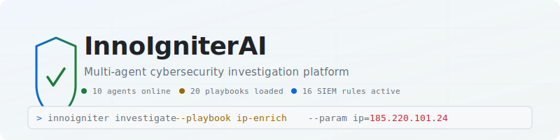

<p align="center">
  <picture>
    <source media="(prefers-color-scheme: dark)" srcset="https://raw.githubusercontent.com/innoigniter/edge/main/docs/assets/banner-dark.svg">
    
  </picture>
</p>

<p align="center">
  <a href="#"></a>
  <a href="#"></a>
  <a href="LICENSE"></a>
  <a href="#"></a>
  <a href="#"></a>
</p>

<p align="center">
  <b>InnoIgniterAI</b> is an open-source, multi-agent cybersecurity investigation platform.
  It orchestrates specialized security agents to triage threats, enrich indicators,
  analyze malicious files, monitor logs in real time, and automate response actions —
  all from a single binary.
</p>

<p align="center">
  <a href="#quick-start"><b>Quick Start</b></a> ·
  <a href="#playbooks"><b>Playbooks</b></a> ·
  <a href="#agents"><b>Agents</b></a> ·
  <a href="#cli-reference"><b>CLI</b></a> ·
  <a href="docs/user-guide.md"><b>User Guide</b></a> ·
  <a href="docs/cli-reference.md"><b>CLI Reference</b></a> ·
  <a href="docs/build-plan.md"><b>Build Plan</b></a>
</p>

---

## Features

| Capability | Description |
|---|---|
| **Threat Triage** | Investigate hashes, files, IPs, domains, emails, and network indicators with a single command |
| **YARA + PE Analysis** | Built-in YARA engine with real malware rules; full PE parser (sections, imports, entropy) |
| **SIEM Monitoring** | File watcher, syslog (UDP/TCP), 6 log decoders, 16 correlation rules with auto-triggered playbooks |
| **Intel Enrichment** | Built-in IOC database (18 entries) + AbuseIPDB, AlienVault OTX, VirusTotal integrations |
| **MITRE ATT&CK** | Offline technique lookup, CVE searching via NVD API |
| **SOAR Actions** | Block IP (firewall), quarantine files, kill processes, restart services — with full rollback |
| **Human-in-the-Loop** | Playbook steps can pause for analyst approval before executing actions |
| **Central Server** | Team dashboard with investigation list, search, detail views, cross-node IOC correlation |
| **Edge Sync** | Distributed deployment — edge nodes push investigations to central server |
| **Notifications** | Slack and Discord webhook alerts for automated incident notification |
| **Plugin System** | Extend with external `.so` plugins loaded at runtime |
| **TLS Support** | Built-in HTTPS with self-signed certificate generation for production deployments |
| **Docker Ready** | Multi-stage Dockerfile + docker-compose for one-command deployment |

---

## Quick Start

### Build from source

```bash
cd dev
go build -o innoigniter ./cmd/innoigniter
```

### Run your first investigation

```bash
# Check a known malicious hash (Mimikatz)
./innoigniter investigate "check hash 275a021bbfb6489e54d471899f7db9d1663fc695ec2fe2a2c4538aabf651fd0f"

# Check a domain reputation
./innoigniter investigate --playbook domain-reputation --param domain=evil.com

# Analyze a file with YARA
./innoigniter investigate --playbook file-analysis --param path=/tmp/suspicious.exe
```

### Setup API keys (optional — local analysis works without them)

```bash
./innoigniter init
```

Interactive wizard prompts for VirusTotal, AbuseIPDB, AlienVault OTX, LLM provider, and web search keys.

### Start the daemon

```bash
# Edge mode with SIEM log monitoring
./innoigniter serve --siem --log-dir /var/log

# Central server mode with web dashboard
./innoigniter server --http-addr :8080

# Edge mode syncing to central server
./innoigniter serve --server-addr http://server-host:8080
```

### Docker

```bash
docker compose up server
# Dashboard at http://localhost:8080
```

---

## Playbooks

InnoIgniterAI ships with **20 built-in playbooks** — YAML workflows that chain agent actions into repeatable investigation procedures.

| Category | Playbook | Purpose |
|---|---|---|
| **Triage** | `hash-lookup` | Check hash against cache, YARA, VT, and intel DB |
| | `file-analysis` | Hash + YARA scan + PE metadata + IOC enrichment |
| | `ip-reputation` | IP address lookup via VT and local intel |
| | `domain-reputation` | Domain/URL check via VT, IOC enrich, web search |
| | `email-analysis` | Analyze phishing email indicators |
| | `network-scan` | Multi-indicator network analysis |
| **Enrichment** | `ip-enrich` | Deep IP enrichment — AbuseIPDB + OTX + VT + IOC |
| | `windows-event-analysis` | Enrich Windows Event with MITRE, CVE, web search |
| | `registry-check` | Analyze registry persistence indicators |
| | `log-analysis` | Log event analysis with YARA, MITRE, CVE |
| | `mitre-lookup` | MITRE ATT&CK technique details |
| | `cve-lookup` | CVE severity, CVSS score, affected products |
| **Response** | `block-ip` | Firewall rule via netsh/iptables/pfctl |
| | `quarantine-file` | Move file to restricted directory |
| | `kill-process` | Terminate process by name or PID |
| | `restart-service` | Restart system service |
| | `rollback-action` | Undo a previously executed response action |
| **Notify** | `slack-notify` | Send alert to Slack webhook |
| | `discord-notify` | Send alert to Discord webhook |

Playbooks are defined in YAML and support variable interpolation (`${input.hash}`), conditional execution (`if:`), timeouts, optional steps, and human-in-the-loop gates (`wait: analyst_approval`).

---

## Agents

| Agent | Package | Capabilities |
|---|---|---|
| **Detection** | `internal/detection` | YARA scan, PE analysis, hash lookup, VirusTotal lookup |
| **Knowledge** | `internal/knowledge` | MITRE ATT&CK, CVE lookup, IOC enrichment, malware lookup, web search |
| **Host** | `internal/host` | Intent classification, playbook planning, report synthesis, confidence scoring |
| **Response** | `internal/response` | Block IP, quarantine file, kill process, restart service, rollback |
| **Notifier** | `internal/integration/notifier` | Slack webhook, Discord webhook |
| **AbuseIPDB** | `internal/integration/abuseipdb` | IP reputation with abuse confidence score |
| **OTX** | `internal/integration/otx` | AlienVault OTX pulse count for indicators |
| **Splunk** | `internal/integration/splunk` | Splunk search, saved search, alert check |
| **Elastic** | `internal/integration/elastic` | Elasticsearch search, alert check, index listing |
| **Exporter** | `internal/plugins/exporter` | HTML report server for investigation dashboards |

All agents implement the `agent.Agent` interface and are registered in a shared plugin registry at startup.

---

## CLI Reference

| Command | Description |
|---|---|
| `init` | First-run setup wizard (prompts for API keys, configures SIEM and telemetry) |
| `serve` | Start edge daemon — task worker, SIEM engine, optional export server and edge sync |
| `server` | Start central server mode — web dashboard, sync API, cross-node correlation |
| `investigate <query>` | Run a security investigation (natural language or explicit playbook) |
| `status <id>` | View investigation status |
| `history` | List recent investigations |
| `report <id>` | Regenerate or save investigation report |
| `approval pending\|approve\|deny <id>` | Human-in-the-loop approval workflow |
| `plugin list\|install\|remove` | Manage external agent plugins |
| `update self\|intel\|playbooks` | Update binary, intel database, or playbook library |
| `genkey` | Generate self-signed TLS certificate and key |
| `completion bash\|zsh\|fish\|powershell` | Generate shell completion scripts |
| `version` | Print version information |

See [docs/cli-reference.md](docs/cli-reference.md) for the full CLI reference with all flags and examples.

---

## Architecture

```
┌─────────────────────────────────────────────────────────────┐
│                         Host Agent                          │
│       Intent Classification → Playbook Matching → Report    │
├──────────┬───────────┬───────────┬───────────┬──────────────┤
│Detection │ Knowledge │ Response  │ SIEM      │ Plugins      │
│ YARA     │ MITRE     │ block IP  │ log       │ external .so │
│ PE       │ CVE       │ quarantine│ decode    │ loader       │
│ VT       │ intel     │ kill      │ rules     │              │
│ hash     │ web search│ rollback  │ alerts    │              │
└──────────┴───────────┴───────────┴───────────┴──────────────┘
         │                                            │
         └────────── Edge sync (opt-in) ──────────────┘
                            │
                    ┌───────┴───────┐
                    │   Server      │
                    │  Dashboard    │
                    │  API          │
                    │  Correlation  │
                    └───────────────┘
```

---

## SIEM Rules

16 built-in detection rules cover Windows Event Log, syslog, and web server logs:

| Rule | MITRE | Severity |
|---|---|---|
| Multiple failed logins (5 in 60s) | T1110.003 | 4 |
| Brute force (20 in 60s) | T1110 | 5 |
| HTTP 5XX errors | — | 3 |
| HTTP 4XX burst (10 in 60s) | — | 2 |
| Suspicious process execution | T1059 | 4 |
| PowerShell script block (Event 4104) | T1059.001 | 3 |
| Scheduled task created (Event 4698) | T1053.005 | 4 |
| New service installed (Event 7045) | T1543.003 | 4 |
| Windows Defender detection (Event 1116) | T1204 | 5 |
| Process creation (Event 4688) | T1059 | 2 |
| Registry persistence (Event 4657) | T1547.001 | 3 |
| RDP failed login (Event 4625) | T1021.001 | 3 |
| Account lockout (Event 4740) | T1110 | 3 |

Rules auto-trigger playbooks. For example, `MULTIPLE_FAILED_LOGINS` fires the `ip-reputation` playbook against the attacker's IP.

---

## Configuration

Configuration is read from `~/.innoigniter/config.json` or set via environment variables:

```bash
export INNO_VT_API_KEY="your-vt-key"
export INNO_ABUSEIPDB_KEY="your-abuseipdb-key"
export INNO_OTX_API_KEY="your-otx-key"
export INNO_LLM_API_KEY="your-llm-key"
export INNO_DB_PATH="/path/to/custom/db"
```

Run `innoigniter init` for an interactive setup wizard.

---

## Development

```bash
cd dev
go build ./cmd/innoigniter
go vet ./...
go test ./... -short -count=1    # fast: skips heavy SIEM tests
go test ./... -count=1           # full: includes correlation tests
go test ./... -bench=. -benchmem # run benchmarks
```

### Project structure

```
dev/
├── cmd/innoigniter/          # CLI entry point (Cobra)
├── internal/
│   ├── agent/                # Agent interface
│   ├── config/               # Configuration loader
│   ├── db/                   # SQLite database with migrations
│   ├── detection/            # YARA, PE, hash, VT
│   ├── edge/                 # Edge sync client
│   ├── host/                 # Orchestrator agent
│   ├── integration/          # External integrations
│   │   ├── abuseipdb/        # AbuseIPDB IP reputation
│   │   ├── elastic/          # Elasticsearch connector
│   │   ├── notifier/         # Slack/Discord webhooks
│   │   ├── otx/              # AlienVault OTX
│   │   └── splunk/           # Splunk connector
│   ├── investigation/        # Investigation manager
│   ├── knowledge/            # MITRE, CVE, intel
│   ├── playbook/             # Playbook engine + YAML library
│   ├── plugin/               # Plugin registry
│   ├── plugins/exporter/     # HTML report server
│   ├── response/             # SOAR actions
│   ├── server/               # Central server + dashboard
│   ├── siem/                 # Log ingestion + correlation
│   ├── taskqueue/            # SQLite-backed task queue
│   └── telemetry/            # Opt-in usage reporting
├── playbooks/                # Editable playbook YAML files
├── intel/                    # IOC seed data
├── docs/                     # Documentation
├── Dockerfile                # Multi-stage build
├── docker-compose.yml        # Server + edge deployment
├── go.mod
└── Makefile
```

---

## Documentation

| Document | Description |
|---|---|
| [User Guide](docs/user-guide.md) | End-to-end walkthrough for analysts with real-world scenarios |
| [CLI Reference](docs/cli-reference.md) | All commands, flags, and examples |
| [Playbook Authoring Guide](docs/playbook-authoring.md) | YAML structure, interpolation, conditions |
| [Plugin Development Guide](docs/plugin-development.md) | Building and distributing plugins |
| [Testing Guide](docs/testing-guide.md) | Verification commands for every phase |
| [Build Plan](docs/build-plan.md) | Phased implementation roadmap |
| [Benchmarks](docs/benchmarks.md) | YARA, PE, SIEM decoder performance |
| [End-to-End Demo (PS1)](docs/end-to-end-demo.ps1) | PowerShell demo script |
| [End-to-End Demo (SH)](docs/end-to-end-demo.sh) | Shell demo script |

---

## Benchmarks

```
YARA Scan EICAR:       18.8k ops — 61μs/op — 3.8KB/op
Hash Lookup Known:     34.4k ops — 33μs/op — 1.9KB/op
WindowsEvent Decoder:  6.2M ops — 212ns/op — 16B/op
JSON Decoder:          287k ops — 4μs/op — 944B/op
```

Full results in [docs/benchmarks.md](docs/benchmarks.md).

---

## License

MIT — see [LICENSE](LICENSE).

---

## Community

- [Issues](https://github.com/innoigniter/edge/issues) — bug reports and feature requests
- [Discussions](https://github.com/innoigniter/edge/discussions) — questions and ideas
- [Security](SECURITY.md) — vulnerability reporting

Built with Go, SQLite, YARA, and the MITRE ATT&CK framework.
