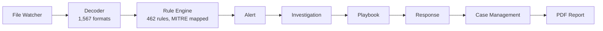
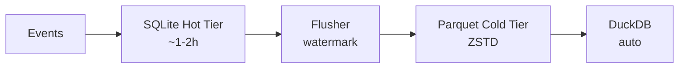
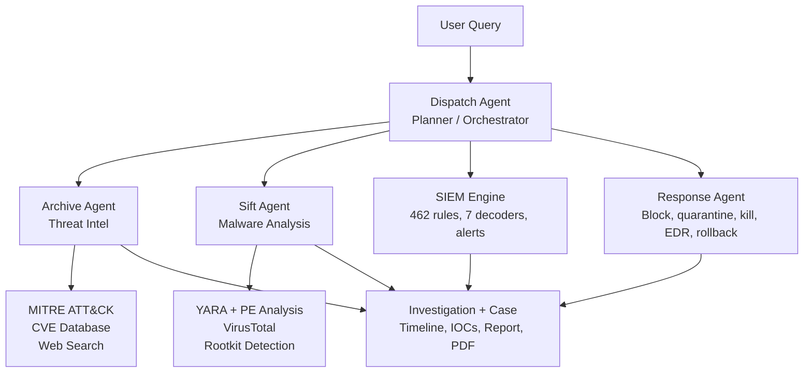

<p align="center">
  
  <br><br>
  <b>Trace — One binary. Full SOC.</b><br><br>
    
    
    
    
  <br><br>
  <b>Trace</b> is an open-source cybersecurity operations platform that fits in one binary.<br>
  It watches logs, detects threats, enriches indicators, runs investigations, and responds — automatically.<br><br>
  No Docker required. No Python runtime. No Elasticsearch cluster. No SIEM license fees.<br>
  Just a single statically-linked Go binary that runs anywhere.
  <br><br>
  <a href="https://github.com/yanmyoaung2004/trace"></a>
  <a href="https://github.com/yanmyoaung2004/trace/releases"></a>
</p>

## Why Trace?

Most SOC tools fall into two camps:

- **Enterprise SIEMs** (Splunk, Sentinel, QRadar) — powerful but expensive, complex, need a team to maintain
- **Open-source SIEMs** (Wazuh, Security Onion) — better, but still need multiple services, agents, and significant infrastructure

Trace is different. It's an **all-in-one SOC platform** that fits in 10MB:


```mermaid
flowchart LR
    FW[File Watcher] --> DEC[Decoder<br/>1,567 formats]
    DEC --> RE[Rule Engine<br/>462 rules, MITRE mapped]
    RE --> AL[Alert]
    AL --> INV[Investigation]
    INV --> PB[Playbook]
    PB --> RES[Response]
    RES --> CASE[Case Management]
    CASE --> PDF[PDF Report]
```

No agents to deploy. No databases to tune. One command, and you have a working SOC.

---

## Quick Start

```bash
git clone https://github.com/yanmyoaung2004/trace.git
cd trace
go build -o trace ./cmd/trace

# Run your first investigation (no setup needed)
./trace investigate "check hash 275a021bbfb6489e54d471899f7db9d1663fc695ec2fe2a2c4538aabf651fd0f"

# Start the SIEM engine
./trace serve --siem --log-dir /var/log
```

That's it. No config files, no API keys, no containers. The built-in IOC database detects Mimikatz, CobaltStrike, Emotet, Ryuk, WannaCry, and other malware — right out of the box.

---

## What Trace Does

### 🔍 Real-Time SIEM

| Capability      | Detail                                                                            |
| --------------- | --------------------------------------------------------------------------------- |
| Log ingestion   | File watcher + syslog (UDP/TCP)                                                   |
| Decoders        | 1,567 formats: JSON, Syslog, Apache, Windows EVTX, CSV, K8s audit, Wazuh decoders |
| Detection rules | 446 Wazuh-derived + 16 built-in — all with MITRE ATT&CK mapping                   |
| Correlation     | Windowed, threshold-based, suppression                                            |
| Alerting        | Auto-creates investigations and cases for severity ≥ 4                            |

### 🧠 Multi-Agent SOAR

| Agent        | What it does                                                                          |
| ------------ | ------------------------------------------------------------------------------------- |
| **Dispatch** | Orchestrates investigations, classifies intents, plans playbooks, synthesizes reports |
| **Sift**     | YARA scanning, PE analysis, hash lookup, VirusTotal, rootkit detection                |
| **Archive**  | MITRE ATT&CK (750 techniques), CVE lookup, IOC enrichment, web search                 |
| **Response** | Block IP, quarantine files, kill processes, restart services — with rollback          |
| **SCA**      | CIS benchmark compliance scanning (64 policies, auto-detect OS)                       |
| **EDR**      | Custom endpoint agent — process/file/network/memory monitoring, 8 response actions    |

### 🔗 Threat Intelligence

| Source               | Cached        | Rate-limited      |
| -------------------- | ------------- | ----------------- |
| VirusTotal           | ✅ 1hr TTL    | ✅ 15s interval   |
| AbuseIPDB            | ✅ 1hr TTL    | ✅ 200ms interval |
| AlienVault OTX       | ✅ 1hr TTL    | ✅ 200ms interval |
| Firecrawl web search | ❌            | N/A               |
| Built-in IOC DB      | ✅ 30-day TTL | N/A               |

### 🎯 Proactive Hunting

Schedule playbooks to run automatically:

```bash
trace hunt create --name nightly-scan \
  --playbook rootkit-scan \
  --schedule 6h

trace hunt list
```

Ships with 3 default hunts: malware scan, compliance audit, rootkit sweep.

### 🛡️ Response Actions

| Action          | Scope                              | Rollback           |
| --------------- | ---------------------------------- | ------------------ |
| Block IP        | iptables, netsh, pfctl             | ✅                 |
| Quarantine file | OS-level move + chmod              | ✅                 |
| Kill process    | By PID or name                     | ❌ (cannot unkill) |
| Restart service | systemctl, sc, launchctl           | ✅ (idempotent)    |
| EDR (3rd party) | CrowdStrike, SentinelOne, Defender | ✅                 |
| EDR (custom)    | trace-agent: 8 response actions    | ✅                 |

### 🤖 Custom EDR Agent

Trace ships its own endpoint agent (`trace-agent`) — no third-party EDR required.

| Capability | Real-Time | Fallback |
|------------|-----------|----------|
| Process monitoring | Linux: netlink proc connector / Windows: ETW | /proc or WMI polling |
| File monitoring | Linux: inotify + fanotify / Windows: ReadDirectoryChangesW | Directory polling |
| Network monitoring | Cross-platform: ss, netstat, lsof | — |
| Memory scanning | Linux: /proc/pid/mem / Windows: VirtualQueryEx | — |
| On-agent YARA | 15+ rules (packer, XOR, Mimikatz, CobaltStrike, PS abuse, etc.) | SHA256 cache |
| Response actions | kill, quarantine, block, script, isolate, release, forensics, snapshot | — |

**Deploy:**
```bash
# On the endpoint
trace-agent --server https://trace-server:8080 --api-key xxx

# From the Trace server
trace edr list
trace edr dispatch <agent-id> isolate
```

### Trace Storage Engine (TSE)

Embedded columnar event store for long-term retention. `trace serve --tse` to enable.


```mermaid
flowchart LR
    EV[Events] --> SQL[SQLite Hot Tier<br/>~1-2h]
    SQL --> FL[Flusher<br/>watermark]
    FL --> PQ[Parquet Cold Tier<br/>ZSTD]
    PQ --> D[DuckDB<br/>auto]
```

| Component | Role |
|-----------|------|
| SQLite hot tier | Hourly tables, 111K events/sec, WAL mode, synchronous=FULL |
| Parquet cold tier | Columnar archive, ZSTD compression, SHA-256 verification |
| Manifest catalog | File tracking + watermark cursor, crash-proven |
| Flusher | Background goroutine, exactly-once semantics, mutex-safe |
| Router | Transparent hot/cold query routing, UUIDv7 dedup |
| Cold reader | Row-group pruning (ts, severity, agent_id), DuckDB auto-select with CGO |

```bash
trace serve --tse
trace tse status                          # standalone or with server
trace tse inspect --storage-path ~/.trace/tse
trace tse config set retention.days 365d
trace tse config show
```

**Verified at 500 events across 4 crash scenarios — zero data loss.**

---

## Architecture


```mermaid
flowchart TB
    UQ[User Query] --> DA[Dispatch Agent<br/>Planner / Orchestrator]
    DA --> AA[Archive Agent<br/>Threat Intel]
    DA --> SA[Sift Agent<br/>Malware Analysis]
    AA --> MITRE[MITRE ATT&CK<br/>CVE Database<br/>Web Search]
    SA --> YARA[YARA + PE Analysis<br/>VirusTotal<br/>Rootkit Detection]
    DA --> SIEM[SIEM Engine<br/>462 rules, 7 decoders, alerts]
    DA --> RA[Response Agent<br/>Block, quarantine, kill, EDR, rollback]
    AA & SA & SIEM & RA --> IC[Investigation + Case<br/>Timeline, IOCs, Report, PDF]
```

## Ingested From Wazuh

Trace converts Wazuh's detection engine into embedded Go code:

| Component          | Source                      | Count                           |
| ------------------ | --------------------------- | ------------------------------- |
| Detection rules    | Wazuh XML → Trace rules     | 446 of 3,111                    |
| Log decoders       | Wazuh XML → Trace decoders  | 1,567 with parent/child chains  |
| CIS policies       | Wazuh YAML → SCARunner      | 64 policies                     |
| Rootkit signatures | Wazuh text → RootkitScanner | 271 files + 76 trojans          |
| MITRE data         | Official STIX bundle        | 750 techniques, 267 mitigations |

Re-run `go run ./tools/wazuh-converter/` to refresh from a newer Wazuh release.

## Configuration

```bash
export TRACE_VT_API_KEY="your-key"          # VirusTotal
export TRACE_ABUSEIPDB_KEY="your-key"       # AbuseIPDB
export TRACE_OTX_API_KEY="your-key"         # AlienVault OTX
export TRACE_LLM_API_KEY="your-key"         # OpenAI / Anthropic / Ollama
export TRACE_LLM_URL="https://api.openai.com/v1/chat/completions"
export TRACE_LLM_MODEL="gpt-4"
```

Run `./trace init` for the interactive setup wizard.

## CLI Commands

| Command / Alias                               | Description                                         |
| --------------------------------------------- | --------------------------------------------------- |
| *(none)*                                      | Full-screen terminal UI (TUI) with 5 screens        |
| `init`                                        | First-run setup wizard                              |
| `serve`                                       | Start daemon with SIEM, hunts, edge sync            |
| `server`                                      | Start central server with dashboard + API           |
| `edr list/view/events/dispatch/revoke`        | Manage EDR agents, dispatch remote actions          |
| `investigate` / `inv`                        | Run an investigation (prompts if no args)           |
| `status` / `st`                               | View investigation status                           |
| `history` / `hist`                            | List recent investigations                          |
| `report`                                      | View investigation report                           |
| `case`                                        | Case management with evidence, IOCs, PDF export     |
| `hunt`                                        | Threat hunting (prompts if no subcommand)           |
| `edr-isolate` / `edr-scan` / `edr-kill-process` | Remote endpoint actions via EDR                    |
| `approval pending/approve/deny`               | Human-in-the-loop                                   |
| `completion`                                  | Generate shell completion scripts                   |
| `compliance report/assess/evidence/frameworks` | Compliance reporting — 8 frameworks, 464 rules mapped, SCA + manual assessment |
| `plugin search/list/install/remove`           | Plugin ecosystem                                    |
| `update self/intel/playbooks/rollback`        | Self-update                                         |
| `version`                                     | Print version                                       |

## Benchmarks

### SIEM & Detection
```
Full pipeline SIEM (SSH brute force):  10,000 events/sec
Full pipeline SIEM (HTTP error):       25,000 events/sec
Rule matching engine:                  500,000 events/sec
All decoders (7, concurrent):          150,000 events/sec
YARA scan (EICAR):                     16,000 ops/sec
Hash lookup (cached):                  34,000 ops/sec
```

### Trace Storage Engine (TSE)
```
Hot store write (1000 events):         56,000 events/sec
Hot store bulk write (100K):           111,000 events/sec
Hot store query (100 from 50K):        48,000 ops/sec
Full pipeline write+flush+read (100):  2,800 events/sec
Cold read full scan (10K events):      46ms
Cold read narrow time-range (100K):    388ms
Parquet write (1000 events):           0.9s (ZSTD)
```

### Test Coverage
```
Packages with tests:                   56/56 (100%)
Total tests:                           ~350+
Data races:                            0
Fuzz inputs:                           2,300,000 (0 failures)
Crash recovery scenarios:              4 (verified at 500 events)
```

## Documentation

| Document                                         | Description            |
| ------------------------------------------------ | ---------------------- |
| [User Guide](docs/user-guide.md)                 | End-to-end walkthrough |
| [CLI Reference](docs/cli-reference.md)           | All commands and flags |
| [Playbook Authoring](docs/playbook-authoring.md) | YAML playbook format   |
| [Plugin Development](docs/plugin-development.md) | Building plugins       |
| [Build Plan](docs/build-plan.md)                 | Development roadmap    |
| [v0.2.0 Plan](docs/v0.2.0-plan.md)               | Next version roadmap   |

## License

MIT — see [LICENSE](LICENSE).

---

<p align="center">
  Built with Go, SQLite, YARA, and the MITRE ATT&CK framework.<br>
  <a href="https://github.com/yanmyoaung2004/trace/issues">Issues</a> ·
  <a href="https://github.com/yanmyoaung2004/trace/discussions">Discussions</a> ·
  <a href="SECURITY.md">Security</a>
</p>
