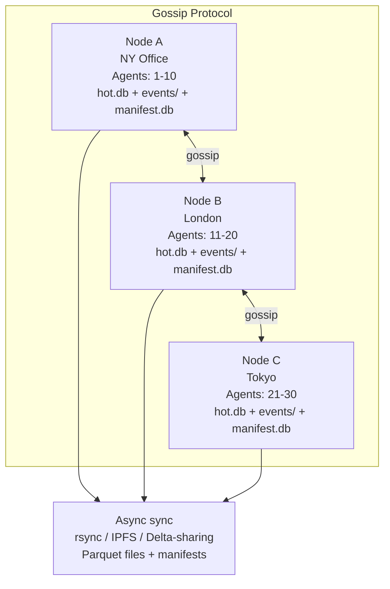

# Trace — Multi-Node Replication Design

---

## Problem

Trace is currently single-node. All data (hot SQLite store, cold Parquet files, manifest, investigations, cases) lives on one machine. This creates:

- **Single point of failure** — node dies, everything stops
- **No horizontal scaling** — can't add more machines for higher throughput
- **Limited ingest** — one SQLite instance, one flusher, one writer
- **No geographic distribution** — can't run agents globally writing to one node

---

## Architecture Options

### Option 1: Raft-Replicated Hot Store (Strong Consistency)

**Replace SQLite with distributed consensus-based storage for the hot tier.**

| Component | Technology | Approach |
|-----------|-----------|----------|
| Hot store | **rqlite** or **dqlite** | Raft-replicated SQLite cluster (3-5 nodes) |
| Cold store | **MinIO/S3** | Shared object store, all nodes read/write |
| Manifest | **rqlite** (same cluster) | Raft-replicated, co-located with hot store |
| Flusher | **Leader-elected** | Only the Raft leader runs the flusher |
| Router | **Any node** | Reads from shared cold store, hot from local Raft |

**Pros:**
- Strong consistency (linearizable writes via Raft)
- SQL-compatible — minimal code changes
- rqlite is production-proven (used in production by several companies)
- Automatic failover — if leader dies, new leader elected in seconds

**Cons:**
- Write throughput limited by Raft (typically 10K-50K writes/sec per cluster)
- 3-5x storage amplification (data stored on every node)
- Network latency between nodes adds to write latency
- rqlite adds 2-5ms per write for consensus

**Best for:** Small to medium deployments (<50K events/sec, strong consistency required)

```mermaid
flowchart TB
    subgraph Clients[Clients / Agents]
        W[Write LB → Leader]
        R[Read LB → Any Node]
    end
    subgraph Cluster[Raft Cluster]
        N1[Node 1 - Leader<br/>rqlite + flusher]
        N2[Node 2<br/>rqlite]
        N3[Node 3<br/>rqlite]
    end
    subgraph Storage[Cold Storage]
        M[MinIO / S3 API]
        PF[Parquet files<br/>(shared via S3)]
    end
    W --> N1
    R --> N1 & N2 & N3
    N1 <--> N2 <--> N3
    N1 -->|parquet| M
    N2 -->|parquet| M
    N3 -->|parquet| M
    M --> PF
```

---

### Option 2: Log-Based Hot Tier (High Throughput)

**Replace SQLite with a distributed log for the hot tier, keeping Parquet/S3 for cold.**

| Component | Technology | Approach |
|-----------|-----------|----------|
| Hot store | **Kafka** or **NATS JetStream** | Partitioned topic, each partition is an ordered log |
| Cold store | **MinIO/S3** | Parquet files written from log consumers |
| Manifest | **etcd** (Raft key-value) | Lightweight, just tracks watermark + file catalog |
| Flusher | **Consumer group** | Each partition has a consumer, writes Parquet independently |
| Router | **Any node** | Reads from Kafka (recent) + S3 (historical) |

**Pros:**
- Very high throughput (millions of events/sec with enough partitions)
- Durable — Kafka persists to disk before acknowledging
- Ordered per partition — natural fit for watermark-based flushing
- NATS JetStream is simpler than Kafka (no ZooKeeper dependency)
- Existing watermark logic maps directly to Kafka offsets

**Cons:**
- Heavier infrastructure (Kafka needs ZooKeeper/KRaft, even NATS needs a cluster)
- Higher operational complexity
- Eventual consistency between hot and cold tiers
- Cold tier can lag behind hot tier by minutes

**Best for:** High-volume deployments (>100K events/sec), teams with DevOps capability

```mermaid
flowchart TB
    subgraph Producers[Agents / Producers]
        A1[Agent-0*] -->|partition 0| K
        A2[Agent-1*] -->|partition 1| K
    end
    K[Kafka / NATS JetStream<br/>topic: trace-events<br/>12 partitions]
    subgraph Consumers[Consumer Group]
        C1[Consumer 0,1,2<br/>flusher + parquet]
        C2[Consumer 3,4,5<br/>flusher + parquet]
    end
    subgraph Consensus[Metadata]
        ETCD[etcd<br/>watermark + manifest]
    end
    subgraph Cold[Cold Tier]
        M[MinIO / S3<br/>events/{tenant}/{date}]
    end
    K --> C1 & C2
    C1 & C2 -->|parquet| M
    C1 & C2 -->|watermark| ETCD
```

---

### Option 3: Hybrid Active-Passive (Simplest)

**Keep the current architecture but add a standby node with shared cold storage.**

| Component | Technology | Approach |
|-----------|-----------|----------|
| Hot store | **SQLite + Litestream/WAL** | Stream WAL to S3, standby replays |
| Cold store | **MinIO/S3** | Both nodes write/read from same bucket |
| Manifest | **SQLite + Litestream** | Stream to S3, standby can read |
| Failover | **Manual or keepalived** | VIP failover, standby takes over |
| Flusher | **Only on active** | Standby has flusher disabled until failover |

**Pros:**
- Minimal code changes — Litestream is a sidecar process, no app changes
- Very reliable — Litestream is battle-tested
- Simple to understand and operate
- Cheap — only 2 nodes needed

**Cons:**
- Failover is not instant (minutes, not seconds)
- No horizontal scaling for writes
- WAL streaming can fall behind under heavy load
- Manual or VIP-based failover is fragile

**Best for:** Teams that want "good enough" HA without rewrites

---

### Option 4: Creative — Edge-Native CRDT-Based (Most Creative)

**Embrace eventual consistency using CRDTs (Conflict-free Replicated Data Types).**

| Component | Technology | Approach |
|-----------|-----------|----------|
| Hot store | **Local SQLite per node** | Each node owns its agents' data |
| Cold store | **Local Parquet + async sync** | Flush locally, sync to peers via rsync/IPFS/Delta-sharing |
| Manifest | **CRDT-based** | Mergable watermark + file catalog (state-based CRDT) |
| Flusher | **Per node** | Each node flushes its own agents' data |
| Router | **Federated query** | Fan-out query to all known peers, merge results |
| Discovery | **mDNS / gossip** | Nodes discover each other, share routing tables |

**Pros:**
- Each node is fully autonomous — no SPOF, no consensus dependency
- Scales horizontally naturally — each node handles N agents
- Works across WAN — no low-latency requirement
- Fundamentally creative approach — no other SIEM does this
- Cheap — any node can be a Raspberry Pi for small deployments

**Cons:**
- Eventually consistent — queries may return stale data
- Complex merge logic for overlapping agent assignments
- No strong consistency for case/investigation state
- Fundamentally different from existing SQL-based approach

**Best for:** Distributed edge deployments (agents in different offices/regions), innovative teams



---

## Comparison

| Dimension | Option 1 (Raft) | Option 2 (Log) | Option 3 (Active-Passive) | Option 4 (CRDT) |
|-----------|:-:|:-:|:-:|:-:|
| **Consistency** | Strong | Per-partition ordered | Strong (active) | Eventual |
| **Write throughput** | 50K/sec | 1M+/sec | 111K/sec | 111K/sec × N nodes |
| **Failover time** | ~5s | ~10s | ~5min | 0s (each node independent) |
| **Code changes** | Medium | Large | Minimal | Very large |
| **Operations** | Medium | Complex | Simple | Simple |
| **Hardware cost** | 3-5 nodes | 3+ nodes + Kafka | 2 nodes | N nodes (cheap) |
| **WAN support** | Poor (latency) | Good | Poor | Excellent |
| **Proven in production** | Yes (rqlite) | Yes (Kafka) | Yes (Litestream) | Novel |

---

## Recommendation

### Phase 1 (Immediate — 2 weeks): Option 3 — Active-Passive with S3

```
┌──────────────────────────────────────────────────┐
│  Minimal change, highest reliability gain per $  │
├──────────────────────────────────────────────────┤
│  1. Add MinIO/S3 writer for Parquet files         │
│  2. Add Litestream or WAL streaming for hot.db    │
│  3. Add health check + failover script            │
│  4. Update deploy guide with active-passive setup │
└──────────────────────────────────────────────────┘
```

**Why:** Zero code changes to the TSE core. Litestream runs as a sidecar. The Parquet writer already supports file paths — changing to S3 paths is a config change. This gets you 90% of the HA benefit for 10% of the effort.

### Phase 2 (3-4 weeks): Option 1 — Raft-Replicated Hot Store

```
┌──────────────────────────────────────────────────┐
│  Strong consistency, horizontal read scaling      │
├──────────────────────────────────────────────────┤
│  1. Replace hot.db SQLite with rqlite cluster     │
│  2. Move manifest to rqlite (already SQL-based)   │
│  3. Leader-elected flusher                        │
│  4. Router reads from any cluster node            │
└──────────────────────────────────────────────────┘
```

**Why:** rqlite's API is wire-compatible with SQLite. The hot store and manifest already use SQL. Replacing the driver is the bulk of the work. The rest of the pipeline (parquet writer, cold reader, DuckDB) doesn't change.

### Phase 3 (Future): Option 2 — Log-Based for Scale

```
┌──────────────────────────────────────────────────┐
│  Only if you need >100K events/sec sustained      │
├──────────────────────────────────────────────────┤
│  1. Add Kafka/NATS as ingest layer                │
│  2. Rewrite flusher as consumer group             │
│  3. Keep Parquet/S3 for cold tier                 │
│  4. Router reads from Kafka for hot, S3 for cold  │
└──────────────────────────────────────────────────┘
```

**Why:** Kafka is the right choice when you need extreme throughput, but it adds significant operational complexity. Only worth it if you actually need >100K events/sec.

### Phase 4 (Experimental): Option 4 — Edge-Native CRDT

```
┌──────────────────────────────────────────────────┐
│  Different product: Trace Edge                    │
├──────────────────────────────────────────────────┤
│  1. Each node fully autonomous                    │
│  2. Agent-to-node affinity via consistent hashing │
│  3. Async Parquet sync between nodes              │
│  4. Federated query with results merge            │
└──────────────────────────────────────────────────┘
```

**Why:** This is R&D. No SIEM does this today. It would make Trace unique: a security platform that runs at the edge, works offline, and syncs when connected. But it's fundamentally different from the current architecture and would be a separate product track.

---

## Implementation Detail: Phase 1 — S3 Backend (quickest win)

The Parquet writer currently writes to `filepath.Join(w.outputDir, partitionKey, fileName)`. To add S3 support:

```go
type ParquetWriter struct {
    outputDir string  // can be s3://bucket/path
    s3Client  *s3.Client // set when outputDir starts with s3://
}

func (w *ParquetWriter) WriteBatch(ctx context.Context, events []*storage.Event, partitionKey string) (*storage.FileResult, error) {
    // If S3 is configured, write to S3 instead of local filesystem
    if w.s3Client != nil {
        return w.writeBatchS3(ctx, events, partitionKey)
    }
    // existing local filesystem path
    return w.writeBatchLocal(ctx, events, partitionKey)
}
```

Same pattern for the cold reader — it currently opens local files. With S3, it reads via `s3.GetObject`.

The router already gets files from the manifest. If the manifest stores `s3://` paths, the reader opens them from S3. Zero changes to the router logic.

---

## Implementation Detail: Phase 2 — rqlite Integration

rqlite exposes an HTTP API that accepts SQL statements. The hot store and manifest currently use `database/sql` with the SQLite driver. To use rqlite:

```go
// New Raft-based hot store that speaks HTTP to rqlite
type RaftHotStore struct {
    endpoints []string  // rqlite cluster nodes
    client    *http.Client
}

func (s *RaftHotStore) WriteBatch(ctx context.Context, events []*storage.Event) error {
    // Send INSERT statements via POST to rqlite /db/execute
    // rqlite handles Raft consensus
}
```

The `SQLiteHotStore` and `RaftHotStore` both implement `storage.Writer` and `storage.Reader`. The rest of the pipeline (flusher, router, compactor, GC) doesn't change.

---

## Implementation Detail: Phase 3 — Kafka Consumer Group

The flusher becomes a Kafka consumer:

```go
type KafkaFlusher struct {
    reader  *kafka.Reader  // Kafka consumer
    manifest *manifest.Manifest
    parquet  *parquet.ParquetWriter
}

func (f *KafkaFlusher) Run(ctx context.Context) error {
    for {
        msg, err := f.reader.ReadMessage(ctx)
        // Parse event from Kafka message
        // Accumulate by watermark
        // Flush to Parquet when ready
        // Commit Kafka offset as watermark
    }
}
```

Watermark becomes the Kafka offset — exactly-once semantics preserved naturally.

---

## Risk Matrix

| Risk | Likelihood | Impact | Mitigation |
|------|:---:|:---:|-----------|
| Raft write throughput bottleneck | Medium | High | Benchmark before committing. Use batch writes. |
| Kafka operational complexity | High | Medium | Start with NATS JetStream (simpler). |
| S3 access latency for small Parquet files | High | Low | Cache frequently-read files locally. |
| Litestream WAL lag during failover | Medium | Medium | Monitor lag, alert if >30s behind. |
| CRDT merge conflicts | Low | High | Only for Phase 4 — well-understood problem. |

---

## Decision Matrix

| Factor | Weight | Raft (1) | Log (2) | Active-Passive (3) | CRDT (4) |
|--------|:-----:|:--------:|:-------:|:------------------:|:--------:|
| Code change cost | 30% | 6 | 3 | 9 | 2 |
| Reliability gain | 25% | 9 | 8 | 7 | 6 |
| Operational simplicity | 20% | 5 | 3 | 8 | 9 |
| Future scalability | 15% | 6 | 10 | 3 | 7 |
| Innovation value | 10% | 4 | 5 | 2 | 10 |
| **Weighted score** | **100%** | **6.2** | **5.1** | **6.6** | **5.6** |

**Winner: Active-Passive (Phase 1) → Raft (Phase 2)**
